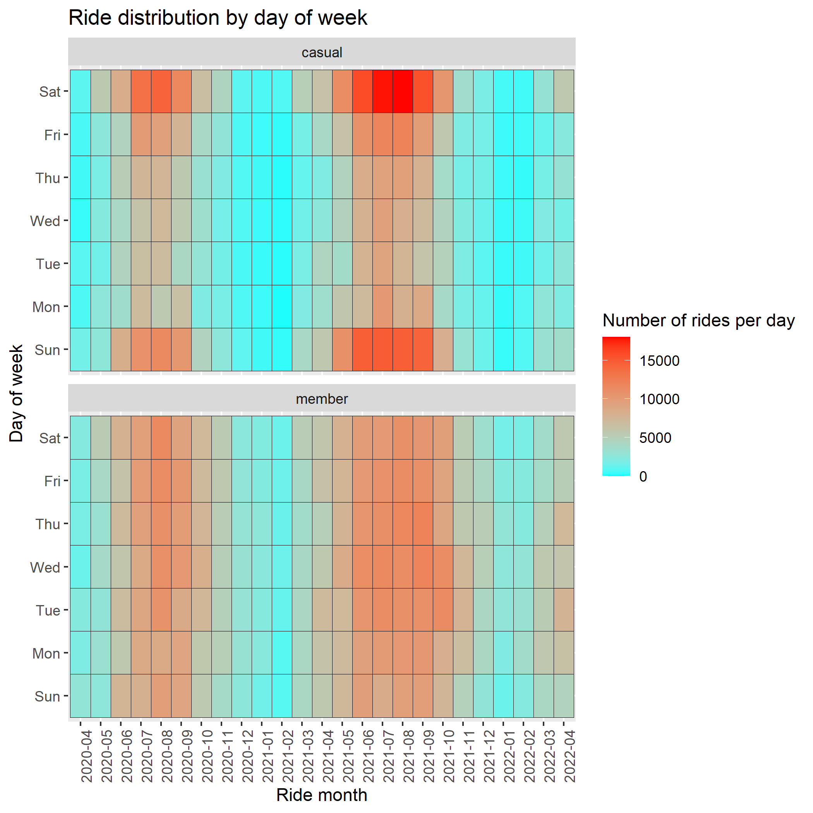

```{r setup, include=FALSE}
knitr::opts_chunk$set(echo = TRUE)
```

# 1. Introduction

In 2016, Cyclistic launched a bike-share service in Chicago, USA. The company's program allows users to unlock bikes at designated stations, and ride them to other stations.

The company has two user models; members who pay a monthy fee, and casual users who pay by the ride. Cyclistic wishes to convert more casual users into members. The purpose of this analysis is to identify key differences between the two types of users that would allow customized targeting of advertisements and business models to maximize converting casual users into members.

The original [data](https://divvy-tripdata.s3.amazonaws.com/index.html) used for this study is available under the license [here](https://ride.divvybikes.com/data-license-agreement).

# 2. Data

While the project has only called for the analysis of the last 12 months of data, here we analyze all of the data available in a singular format (from April 2020 to April 2022 for 25 months total) for the sake of completeness.

All data analysis was performed using R.

## Data Cleaning

A number of basic data cleaning steps were performed before the analysis

* All rides with 0 or negative duration were removed

* All rides without a labeled start or end station name or id were removed

* Rides starting or ending at one of 6 testing locations were removed

* A number of stations had multiple names, as they were sometimes marked with extra qualifiers. These were fixed, and normalized to one. See data preparation for more details

* For a small number of stations, their renaming was identified and fixed

## Limitations

While the nature of the automated data collection removes the risk of human error, there are still a number of limits to be aware of.

* Over the span where the data was collected, the city of Chicago has renamed a number of streets. As such a list of changes wasn't provided, this couldn't be corrected for in the data

* There is some ambiguity regarding match station id numbers to station names.

* Originally, there was only a _docked bike type_, while the _electric bike type_ and _classic bike type_ were later introduced, while the data showing a transitory period of approximately 5 months during which the _docked bike type_ classification was phased out. However, even after those 5 months, casual users continued to use the _docked bike type_, accounting for between 10% and 20% of rides, while members never used any _docked bike types_ again. The reason for this is uncertain, and may or may not indicate an interesting difference between users.

* Approximately 10% of all rides are missing a start or end station location. These were removed for the sake of the analysis, however this is a significant enough chunk of the total data to need to keep aware of.

For a more thorough analysis, it would be necessary to have secondary discussions with the shareholders as Cyclic for an explanation for these, and how to best correct them, or which could be ignored.

# 3. Results

There are a few major differences in the usage habits between casual users and members.

## 3.1 Bike Type


Until July of 2020, only one bike type, the _docked bike_ was available. Over the next 5 months, the bike types _electric bike_ and _classic bike_ were introduced to replace it. Both members and casual users used _electric bikes_ at the same rate. However, while members stopped using _docked bikes_ by November of 2020, some casual users continued using them at a low rate.

Unfortunately, it isn't clear what the source of this is. Perhaps some older bikes are still registered at _docked bikes_ without having their classification updated. If so, it is still interesting that only casual members would use them, and if more data and time were available, this might be worse exploring. Even if it is a technical artifact, this is worse exploring simply to fix any record keeping software that is running.

## 3.2 Ride Duration


Members prefer to do shorter rides than custom users. Here we calculated the percentage of rides each month that had a given duration, and calculated the difference between members and users. For example, a value of 20% could be achieved by having 20% of all member rides falling into a specific temporal bin, while no casual rides had that duration. As such, some of the bins indicate fairly major differences between the two user groups.

With this, we can clearly see that members perform 10 minute or shorter rides far more frequently than casual users, while casual users tend to engage in rides that are 20 minutes to a few hours longer far more frequently than members.

## 3.3 Ride Time


There are clear preferences in the hourly cycling time of members and casual users. For one, cycling at a later time is more popular in the summer times, compared to the winter months. For another, casual users, in a given month, have a fairly unimodal distribution of ride times. They will do most of their cycling between 5pm and 7pm depending on the month. Members have a more bimodal distribution, as there is another uptick between 7am and 9am, presumably for work.



Our second plot bears this out, where we see that members tend to cycle all days of the week, while casual users restrict themselves to cycling over the weekend only. Neither group cycles much during the winter months.

## 3.4 Preferred Stations


There are some stations that are significantly more frequently visited by casual users than by members. 

# 4. Recommendations

Cyclistic asks that we identify data and methods based on that data to convert casual users into full-time members. This allows them to focus their advertising on customers already aware of their services. Based on the data, there are 4 key ways in which casual users and members differ:

* Casual users prefer to take longer trips than members

* Casual users heavily favor riding on weekends, where as members also prefer to ride during the weekdays

* Many members ride at times that suggest they use the services for a work commute, while the same habit is not seen in casual users

* While there are more bike rides by members, there are a number of stations where rides are dominated by casual users

Based on these, there are 3 key recommendations

## 4.1 Focus on convenience

As section 3.3 highlights, casual users tend to use the service only late in the day on the weekends, while members use it throughout the week, including during their morning commute. A digital campaign highlighting the viability and value of commuting to work via bike - such as health benefits and the ability to work around traffic - could be used to encourage existing casual users to buy a membership.

A secondary study on the difference in commute times between biking and driving to work - and the cost for Cyclistic in investing in strategically located stations to reduce the commute time for biking to work - could also be of value. If commute times via biking could be lower, such benefits could be highlighted in a digital campaign.

## 4.2 Focus on long rides

As casual users tend to take more longer rides, this could be approached in two ways. The benefits and convenience of shorter bike rides could be highlighted, suggesting that the user could make their general life simpler and more enjoyable by taking many shorter bike rides throughout the day. Alternatively, the cost saving of a monthly subscription could be highlighted. Every time a casual user does a long ride, they could receive a notification of how much this cost, and how much a single monthly subscription could be. A suggested marketing technique might be that if a casual user takes a day-long trip, at the end of the trip, the cost of their trip could be subtracted from their first month's subscription fee.

## 4.3 Targetting locations

With the knowledge of where casual cyclist are most common, advertisements could be targeted to those locations. This could be done either with digital apps that send alerts to those locations, or by having the adverts for the services involve biking in those locations. If a potential customer can see themselves in an ad - such as by recalling biking through the same location - they might be more likely to accept its message.